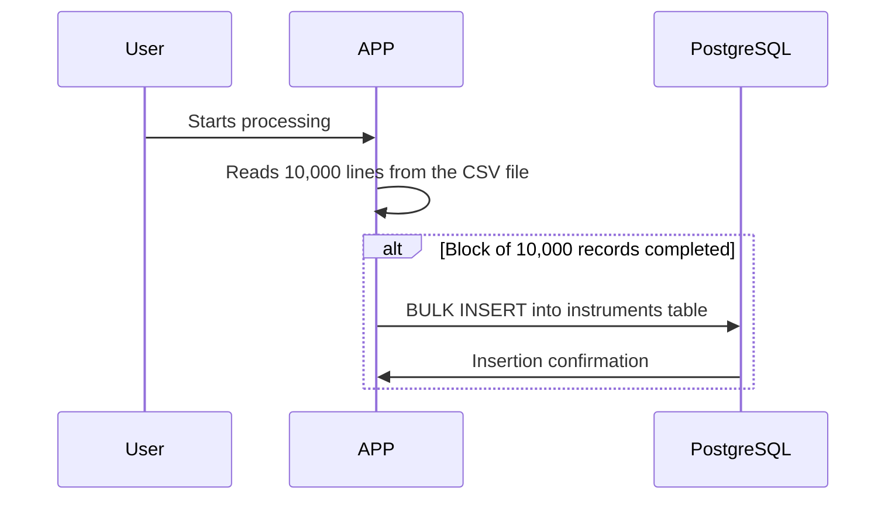

# APP FileDBImport

This project compares two strategies for importing a CSV file into a PostgreSQL database.

## Technologies Used:
- .NET 8
- PostgreSQL
- Dapper

## INSERT Strategy:
In this strategy we use an INSERT for each line of the CSV. In the example, we have a file with 78,777 lines, requiring 78,777 trips to the database to complete the import.

## BULK Strategy:
In this strategy we use BULK with blocks of 10,000 records, reducing the number of trips to the database to 8.

# Conclusion
The BULK strategy proves to be much more efficient. By inserting blocks of 10,000 records, it can be up to 21 times faster.

